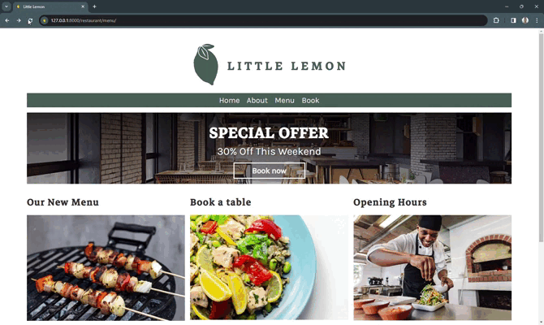

# Little Lemon Restaurant

Capstone project for Meta Back-end developer professional certification program on Cousera. This project is a restaurant management system that allows the user to create a menu, add items to the menu, create a booking, and assign a table to the booking.

Course link: [Meta Back-end Developer Professional Certificate ](https://www.coursera.org/professional-certificates/meta-back-end-developer)

# Preview


## Tech Stack
* Django
* Django REST Framework
* Pipenv
* Docker
* MySQL
* Djoser

##  Installation

1. Clone the repository: 
  ```bash
    git clone https://github.com/serodas/LittleLemon.git
  ```

2. Change directory to the project folder: 
  ```bash
    cd LittleLemon
  ```

3. Create mysql container:
  ```bash
    docker-compose up -d
  ```

2. Create a virtual environment:
  ```bash
    pipenv shell
  ```

3. Install the requirements: 
  ```bash
    pipenv install
  ```

4. Run the migrations: 
  ```bash
    python manage.py migrate
  ```

5. Run the server: 
  ```bash
    python manage.py runserver
  ```

6. Run the tests: 
  ```bash
    python manage.py test
  ```

7. Create a superuser: 
  ```bash
    python manage.py createsuperuser
  ```

#  API paths to test the application

* http://127.0.0.1:8000/restaurant/menu/

* http://127.0.0.1:8000/restaurant/menu/items/

* http://127.0.0.1:8000/restaurant/menu/items/{int:pk}

* http://127.0.0.1:8000/restaurant/booking/

* http://127.0.0.1:8000/restaurant/booking/tables/
